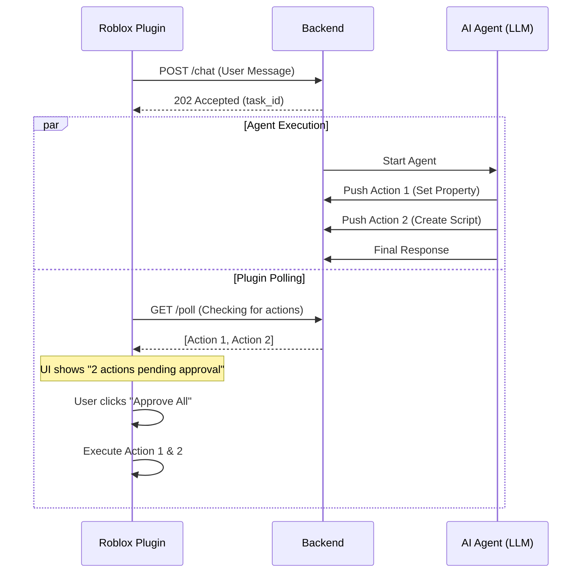

# Optimization Report: Reducing Latency and Batching Issues

## Current Bottlenecks
1. **Synchronous Blocking**: The `/chat` endpoint waits for the entire LLM process to finish.
2. **Sequential Tooling**: The agent calls tools (like `get_full_script`) and blocks until the plugin polls and responds.
3. **Batch Delivery**: All actions are returned in a single JSON response at the very end.

## Proposed Architecture: "Incremental Action Streaming"

### 1. Backend: Async Action Queue
- Modify `Session` to include an `action_queue`.
- The Agent will be modified to "yield" or "push" actions to this queue as soon as they are generated, rather than returning them at the end.
- The `/chat` endpoint will return immediately with a `task_id`, and the plugin will poll for actions.

### 2. Plugin: Incremental Polling & Approval
- The plugin will poll `/poll/{session_id}` more frequently (or use long-polling).
- New actions will be added to a "Pending Approval" list in the UI.
- Users can approve actions in batches as they appear, rather than waiting for the entire task to finish.

### 3. Tooling: Parallel/Speculative Execution
- Implement a "Fast-Path" for tools where the backend maintains a more aggressive cache of the project structure.
- Reduce the `poll_timeout` and implement a more efficient retry mechanism for the `422 Unprocessable Entity` errors seen in logs.

## Mermaid Diagram: Optimized Flow

## Next Steps
1. **Switch to Code Mode** to modify `backend/session.py` and `backend/models.py` to support the action queue.
2. Update `backend/agent.py` to push actions to the session queue.
3. Update `plugin/Main.server.lua` to handle incremental action batches.
